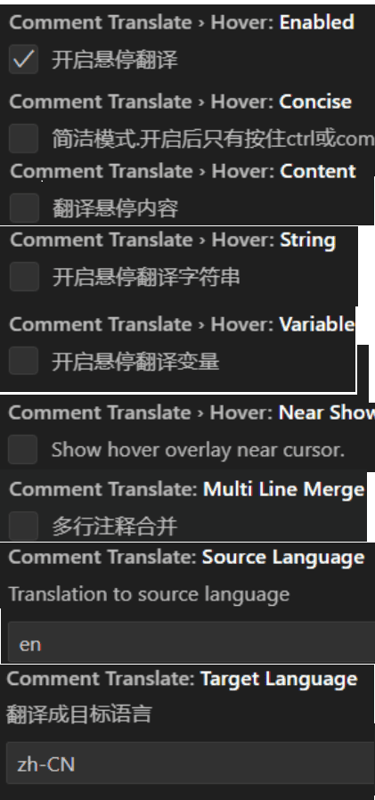

# vscode 适配 go语言

## 1、版本

1. `go version: 1.20.6`
2. `vscode 最新版本`
3. `win11 最新版本`

## 2、安装

1. [go-1.20.6.msi](https://dl.google.com/go/go1.20.6.windows-amd64.msi)
2. 改完配置
    ```shell
    PS D:\GolandProjects\src\kfkconn> go env     
    set GO111MODULE=on
    set GOARCH=amd64
    set GOBIN=
    set GOCACHE=C:\Users\znn\AppData\Local\go-build
    set GOENV=C:\Users\znn\AppData\Roaming\go\env
    set GOEXE=.exe
    set GOEXPERIMENT=
    set GOFLAGS=
    set GOHOSTARCH=amd64
    set GOHOSTOS=windows
    set GOINSECURE=
    set GOMODCACHE=D:\GolandProjects\pkg\mod
    set GONOPROXY=
    set GONOSUMDB=
    set GOOS=windows
    set GOPATH=D:\GolandProjects
    set GOPRIVATE=
    set GOPROXY=https://goproxy.cn,direct
    set GOROOT=D:\Go
    set GOSUMDB=off
    set GOTMPDIR=
    set GOTOOLDIR=D:\Go\pkg\tool\windows_amd64
    set GOVCS=
    set GOVERSION=go1.20.6
    set GCCGO=gccgo
    set GOAMD64=v1
    set AR=ar
    set CC=gcc
    set CXX=g++
    set CGO_ENABLED=0
    set GOMOD=D:\GolandProjects\src\kfkconn\go.mod
    set GOWORK=
    set CGO_CFLAGS=-O2 -g
    set CGO_CPPFLAGS=
    set CGO_CXXFLAGS=-O2 -g
    set CGO_FFLAGS=-O2 -g
    set CGO_LDFLAGS=-O2 -g
    set PKG_CONFIG=pkg-config
    set GOGCCFLAGS=-m64 -fno-caret-diagnostics -Qunused-arguments -Wl,--no-gc-sections -fmessage-length=0 -fdebug-prefix-map=C:\Users\znn\AppData\Local\Temp\go-build36862836=/tmp/go-build -gno-record-gcc-switches
    ```
3. 顺序： \
    安装完go目录 `D:\Go`
    - 编辑用户变量 **GOPATH** **GOROOT**
    - 编辑系统变量 **Path** -> %GOPATH%\bin  D:\GO\bin
    
    安装完vscode 目录 
    - 在GOPATH 目录下创建src、pkg、bin三个文件夹
    - 安装插件go 并更新Go 工具-> ctrl + shift + P 搜索 Go: Install/Update Tools：
    - 会在 bin目录下命令 在src写代码 在pkg下载第三方依赖位置
    - go插件扩展 -> 扩展设置 -> @ext:golang.go path -> "go.gopath": "D:\/GolandProjects","go.goroot": "D:\/Go" 补全
4. 安装翻译插件
    - vscode 安装插件 Comment Translate v2.3.3  
    修改Change translate source 为bin
    - ctrl + , 输入Comment Translate
    

## 问题 

#### 1.第三方依赖飘红但但能运行
    解决：可以执行说明各种包没有问题，所以飘红是VsCode 的问题。将VScode打开目录打开到 go.mod的上一级。

    解释：新版本下go get install 会将包依赖安装到pkg\mod下，而同时，我将工作目录打开在了我项目的go.mod的上上一级，因此 VScode只会在 src下寻找我的依赖包，不去寻找mod cache,因此找不到报错，但go环境可以找到（VSCOde为啥找不到呢，唉）可以执行。.以后注意打开的目录层级，之前一直没注意过！！！！！！！！

#### 2.一个全球代理为 Go 模块而生
    GOPROXY = "https://goproxy.io,direct"